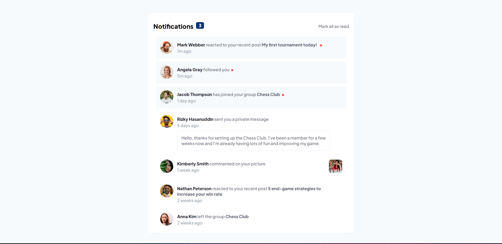

# Frontend Mentor - Notifications page

**To do this challenge, you need a basic understanding of HTML, CSS and JavaScript.**

## The challenge 

Your users should be able to: 

- Distinguish between "unread" and "read" notifications
- Select "Mark all as read" to toggle the visual state of the unread notifications and set the number of unread messages to zero
- View the optimal layout for the interface depending on their device's screen size
- See hover and focus states for all interactive elements on the page

## Screenshot 

## Built with...
- HTML5
- CSS3 
- JavaScript

